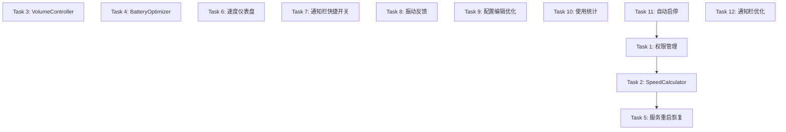

# Implementation Plan: 音速骑士 - 功能完善

## Overview

本文档基于需求文档和技术设计，分解为可执行的开发任务。任务按优先级和依赖关系组织。

## Tasks

### Phase 1: P0 必须实现（核心体验）

- [x] 1. 完善权限管理系统 - 创建 PermissionHelper.java 类，实现权限检查和请求方法，更新 AndroidManifest.xml 添加位置和蓝牙权限，更新 MainActivity.java 实现权限请求流程，创建权限说明对话框布局
- [x] 2. 创建 SpeedCalculator 速度计算器 - 实现 SpeedCalculator.java 类融合加速度传感器和 GPS 数据，实现加速度传感器处理（低通滤波、积分估算），实现 GPS 速度检测和有效性验证，实现传感器融合算法，重构 SpeedVolumeService.java 使用新的 SpeedCalculator
- [x] 3. 创建 VolumeController 音量控制器 - 创建 VolumeController.java 类封装 AudioManager 操作，实现音量平滑过渡算法，重构 SpeedVolumeService.java 使用 VolumeController，添加音量限制配置
- [x] 4. 创建 BatteryOptimizer 电量优化器 - 创建 BatteryOptimizer.java 类监测电池状态，实现智能采样策略，重构 SpeedVolumeService.java 集成 BatteryOptimizer，添加电量状态显示
- [x] 5. 修复服务重启恢复 - 更新 SpeedVolumeService.java 确保 START_STICKY 返回值，实现 onTaskRemoved() 方法，使用 AlarmManager 设置重启定时器，更新 AndroidManifest.xml 添加 stopWithTask=false 属性，实现状态恢复

### Phase 2: P1 应该实现（用户体验）

- [x] 6. 优化主界面 - 速度仪表盘 - 创建自定义 View SpeedDashboardView.java，设计仪表盘外观（圆形表盘、速度刻度、指针动画），更新 activity_main.xml 替换进度条，更新 MainActivity.java 适配新组件，支持夜间模式
- [x] 7. 添加通知栏快捷开关 - 创建 SpeedVolumeTileService.java 继承 TileService，更新 AndroidManifest.xml 注册 TileService，实现服务启停逻辑，设计磁贴图标和标签
- [x] 8. 添加振动反馈 - 创建 VibrationHelper.java 类封装振动操作，更新 SpeedVolumeService.java 在阈值时触发振动，更新 SpeedVolumeConfig.java 添加振动设置，更新配置界面添加振动开关
- [x] 9. 改进配置编辑界面 - 更新 ConfigActivity.java 添加输入验证，创建实时预览组件显示函数曲线图，优化输入交互使用 Slider 替代 EditText，添加配置模板

### Phase 3: P2 可以实现（锦上添花）

- [x] 10. 创建使用统计功能 - 创建数据库定义 SQLite Schema 和 UsageStatsDbHelper.java，创建 UsageStatsRepository.java 封装数据库操作，更新 SpeedVolumeService.java 记录会话和快照，创建统计展示界面，实现数据导出为 CSV
- [x] 11. 添加自动启停功能 - 创建 BluetoothReceiver.java 监听蓝牙连接状态，更新 SpeedVolumeConfig.java 添加自动启停设置，创建蓝牙设备选择界面，更新 SpeedVolumeService.java 接收蓝牙广播自动启停
- [x] 12. 优化通知栏显示 - 创建自定义通知布局显示速度和音量，更新 SpeedVolumeService.java 使用自定义布局，优化通知样式支持深色模式，添加通知操作按钮（暂停、停止、打开应用）

## Task Dependency Graph

## Notes

### 执行建议

**第一轮迭代（1-2周）**
- Task 1 → Task 2 → Task 5（顺序执行）
- Task 3 和 Task 4（可并行）

**第二轮迭代（1周）**
- Task 6 和 Task 7（可并行）
- Task 8 和 Task 9（可并行）

**第三轮迭代（可选）**
- 根据用户反馈决定是否实现 Phase 3

### 验收标准参考

每个任务的详细验收标准请参考需求文档和设计文档中的相关章节。
